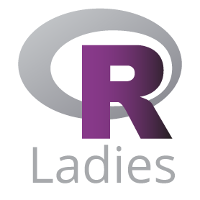

Desde RLadies Madrid queremos darle caña a la comunidad y crecer haciendoos crecer a vosotr@s tambien, para ello hemos pensado que la mejor manera de hacerlo es en lugar de contarlo hacerlo a través de los grupos de trabajo!

# ¿Qué son los grupos de trabajo?
Son grupos de trabajo para desarrollar proyectos propuestos por vostr@s mism@s basados en R!
Pueden ser grandes proyectos de desarrollo de algoritmos que lean la mente o paquetes que contengan recopilación de datos interesantes. 

No se exige nivel para participar en los proyectos, tan sólo tener ganas de colaborar y comprometerte a dedicarle tiempo! Desarrolla cuando y donde puedas!! 

# ¿Cómo funcionan?

Se proponen proyectos de trabajo (Tú también puedes proponerlos!!) y si consigues que al menos 2 personas más quieran participar se inicia el proyecto, la idea es tener reuniones de seguimiento para evaluar que el proyecto continúa vivo, pero aquí se realizarán cuando l@s componentes del proyecto puedan! 

Desde Rladies Madrid os daremos el soporte y seguimiento necesario para que el proyecto llegue a buen puerto! Todo el código que se genere será Open Source y es la mejor manera de crear un buen Curriculum para l@s participantes!

## ¿Cómo puedo participar?
1. Ficha un proyecto que te mole! 
2. Escribe a Rladies indicando tu usuario de gitHub  ( madrid@rladies.org )
3. Te contestaremos indicando el estado del proyecto y los accesos al repo
4. Happy Rcoding!! Pushea como si no hubiera un mañana
5. Periódicamente desde Rladies os iremos preguntando/ayudando en el proyecto!

## ¿Puedo proponer un proyecto para desarrollar?
Por supuesto!!! Este es el objetivo de los grupos de desarrollo, si tienes alguna idea que te apetece implementar no dudes en proponerlo! Escribe un mail a madrid@rladies.org con tu propuesta y lo publicaremos y le daremos caña para que mas gente se una.

## No sé mucho de R ...
No importa tu nivel, importan las ganas que tengas de hacer cosas, todo lo demás se puede aprender!

## 5 Razones por las que participar en los grupos de trabajo
1. Porque tendrás el apoyo de la comunidad para empezar a desarrollar si no lo hiciste nunca
2. Porque podrás tener unas referencias de curriculum públicas, que todo el mundo vea de lo que eres capaz!
3. Porque podrás conocer a gente increíble con la que trabajar
4. Porque podrás aportar cuando y cuanto puedas, cada uno tenemos un ritmo!
5. Porque te ayudaremos en los problemas que te vayas encontrando

Sin duda una oportunidad para darte a conocer y entrar en una comunidad donde aportar y aprender!

